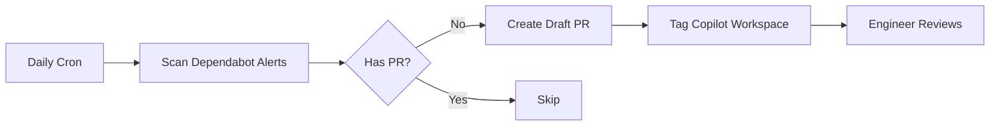

# Dependabot Wolf 🐺

Automated GitHub Action that fixes stuck Dependabot security alerts using GitHub Copilot Workspace.

## What It Does

When Dependabot security alerts remain unfixed, Dependabot Wolf automatically creates PR proposals using GitHub Copilot Workspace.

**"Stuck" alerts are those without open PRs:**
- Dependabot couldn't create a PR (dependency conflicts, peer dependency mismatches)
- Dependabot PR was closed (breaking changes, test failures, rejected by maintainers)

**Dependabot Wolf:**
1. Finds all open Dependabot alerts without open PRs
2. Creates a draft PR for each stuck alert with full context
3. Tags `@github-copilot workspace` to propose a fix
4. Engineers use Copilot to interactively resolve the issue

## How It Works

## Installation

1. **Enable Dependabot alerts** on your repository (Settings → Security → Dependabot)

2. **Create a Personal Access Token (PAT)**:
   - Go to GitHub Settings → Developer settings → Personal access tokens → Fine-grained tokens
   - Create a token with the following permissions:
     - Repository access: Select the repository
     - Permissions:
       - `Contents`: Read and write
       - `Pull requests`: Read and write
       - `Security events`: Read only (for Dependabot alerts)
   - Copy the token

3. **Add the PAT as a repository secret**:
   - Go to your repository Settings → Secrets and variables → Actions
   - Create a new secret named `DEPENDABOT_PAT`
   - Paste your PAT as the value

4. **Copy the workflow file** `.github/workflows/dependabot-wolf.yml` to your repo

5. The workflow runs daily (via cron) or manually via `workflow_dispatch`

## Why a PAT is Required

GitHub's default `GITHUB_TOKEN` in workflows cannot access Dependabot alerts for security reasons. A Personal Access Token with `security_events` scope is required to read Dependabot alerts via the API.

## Configuration

The workflow requires the following permissions (configured via the PAT):
- `contents: write` - To create branches
- `pull-requests: write` - To create PRs
- `security-events: read` - To read Dependabot alerts

## Testing

This repo demonstrates a **genuine transitive dependency conflict** that Dependabot cannot resolve:

### The Scenario
Multiple packages transitively depend on `body-parser@1.19.0`, which in turn depends on vulnerable `qs@6.5.2`:
- `express@4.18.0` → `body-parser@1.19.0` → `qs@6.5.2` (vulnerable)
- `@remix-run/express@2.0.0` → transitive `body-parser` → `qs`
- `@remix-run/dev@2.0.0` → transitive `body-parser` → `qs`

**Why Dependabot cannot fix this:**
- `qs` vulnerability requires upgrading to 6.11.0+
- But `body-parser@1.19.0` locks `qs` at the old version
- Upgrading requires updating multiple root dependencies simultaneously
- This is a **diamond dependency problem** Dependabot cannot solve

**When Wolf activates:**
1. Dependabot detects `qs` vulnerability but CANNOT create a PR
2. Alert remains open with no PR (genuinely stuck)
3. Wolf creates a draft PR with `@github-copilot workspace` tag
4. Engineers use Copilot to analyze and propose coordinated package updates

## License

MIT
