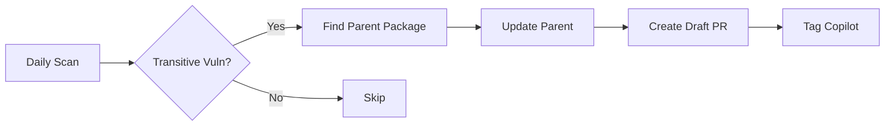

# Dependabot Wolf 🐺

Automatically fixes transitive dependency vulnerabilities that Dependabot can't handle.

## The Problem

You have a security alert like this:
```
your-app
  └─> parent-package@1.0.0
        └─> vulnerable-package@1.0.0 ⚠️ CVE-2024-1234
```

**Dependabot raises the alert but explicitly says it cannot create a PR** because:
- The vulnerable package isn't directly in your `package.json`
- Fixing it requires updating the parent dependency
- That update is either:
  - Outside your allowed version range, or
  - A major/breaking version upgrade, or
  - Ambiguous (multiple parents, conflicting constraints)

**Result:** Alert shows "Dependabot cannot update to a non-vulnerable version." Your team doesn't know which parent to update.

## The Solution

When Dependabot says "cannot create a PR," Wolf steps in:
1. Scans for transitive dependency alerts without open PRs
2. Analyzes `package-lock.json` to find the parent dependency
3. Updates the parent to latest version (even if major/breaking)
4. Creates a draft PR with the fix + full CVE context

**Your team gets:** A concrete fix to review instead of a vague alert. You can see exactly what needs updating and why.

## Quick Start

### 1. Create a Personal Access Token (PAT)

GitHub's default `GITHUB_TOKEN` can't read Dependabot alerts, so you need a PAT:

1. Go to **GitHub Settings** → **Developer settings** → **Personal access tokens** → **Fine-grained tokens**
2. Click **Generate new token**
3. Configure:
   - **Repository access**: Select your repository
   - **Permissions**:
     - Contents: **Read and write**
     - Pull requests: **Read and write**
     - Security events: **Read-only**
4. Generate and copy the token

### 2. Add PAT as Repository Secret

1. Go to your repo's **Settings** → **Secrets and variables** → **Actions**
2. Click **New repository secret**
3. Name: `DEPENDABOT_PAT`
4. Value: Paste your token
5. Click **Add secret**

### 3. Add Workflow File

Copy [`.github/workflows/dependabot-wolf.yml`](.github/workflows/dependabot-wolf.yml) to your repository.

The workflow runs:
- **Daily** at midnight (via cron)
- **Manually** via the Actions tab

### 4. Enable Dependabot Alerts

If not already enabled:
1. Go to **Settings** → **Code security and analysis**
2. Enable **Dependabot alerts**

Done! Wolf will start monitoring your alerts.

## Example

This repo includes a real vulnerability to demonstrate how Wolf works.

**The scenario:**
```
rimraf@5.0.0
  └─> glob@10.4.5 (VULNERABLE - CVE-2025-64756)
```

**The problem:**
- `glob` has a command injection vulnerability
- It's a transitive dependency (not directly in `package.json`)
- Dependabot detects it but can't create a PR

**Wolf's fix:**
```diff
  "devDependencies": {
-   "rimraf": "5.0.0"
+   "rimraf": "^6.1.2"
  }
```

**Result:** rimraf@6.1.2 brings in glob@13.0.0 (patched) ✅

See [PR #31](https://github.com/engseclabs/dependabot-wolf/pull/31) for the actual fix Wolf created.

## Real-World Example

This pattern matches [playlab PR #2234](https://github.com/playlab-education/playlab/pull/2234):
- Vulnerability: `glob` via `@sentry/vite-plugin`
- Fix: Update `@sentry/vite-plugin` from 3.3.1 to 4.6.1
- Dependabot couldn't figure this out automatically

## How It Works



**Technical details:**
1. Scans Dependabot alerts for transitive dependencies
2. Filters for alerts without open PRs (stuck alerts)
3. Reads `package-lock.json` to identify the parent package
4. Updates parent to latest version (e.g., `rimraf@5.0.0` → `rimraf@6.1.2`)
5. Commits fix with patched transitive dependency and creates draft PR

## FAQ

**Q: Why not just use Dependabot?**
A: Dependabot detects transitive vulnerabilities but explicitly says it "cannot create a PR" when the fix requires updating a parent dependency outside the allowed range, a major upgrade, or has ambiguous constraints.

**Q: Will Wolf create PRs for everything?**
A: No, only for transitive dependency alerts where Dependabot raised an alert but couldn't create a PR.

**Q: Is it safe to auto-merge Wolf PRs?**
A: No! These are draft PRs for review. Major version bumps may have breaking changes.

**Q: Does this work with npm only?**
A: Currently yes. PRs welcome for pip, Maven, Go modules, etc.!

**Q: What if the parent package can't be updated?**
A: Wolf will either skip the alert or create a PR explaining what needs manual investigation.

## Contributing

PRs welcome! Especially for:
- Support for other package managers (pip, Maven, Go modules, etc.)
- Better heuristics for identifying parent dependencies
- Improved PR descriptions

## License

MIT

---

**Note:** This is an experimental tool focused on transitive dependency vulnerabilities. Always review PRs before merging, especially for major version updates.
