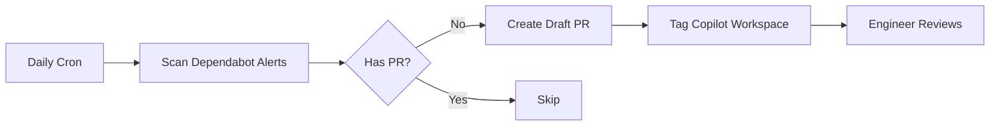

# Dependabot Wolf 🐺

Automated GitHub Action that fixes stuck Dependabot security alerts using GitHub Copilot Workspace.

## What It Does

When Dependabot security alerts remain unfixed, Dependabot Wolf automatically creates PR proposals using GitHub Copilot Workspace.

**Perfect for transitive dependency vulnerabilities:**
- Vulnerability is in a sub-dependency (e.g., `qs` via `body-parser`)
- Dependabot creates PR to update parent dependency without explaining why
- Teams reject/ignore PRs without security context
- **Wolf provides full context + Copilot assistance** to understand and fix

**"Stuck" alerts are those without open PRs:**
- Dependabot PR was closed (unclear purpose, breaking changes, rejected)
- Dependabot couldn't create a PR (dependency conflicts, peer mismatches)
- Alert is ignored (team doesn't understand the transitive relationship)

**Dependabot Wolf:**
1. Finds all open Dependabot alerts without open PRs
2. Creates draft PR with CVE details, affected packages, and dependency tree context
3. Tags `@github-copilot workspace` for AI-assisted analysis
4. Engineers use Copilot to understand transitive relationships and implement fix

## How It Works



## Installation

1. **Enable Dependabot alerts** on your repository (Settings → Security → Dependabot)

2. **Create a Personal Access Token (PAT)**:
   - Go to GitHub Settings → Developer settings → Personal access tokens → Fine-grained tokens
   - Create a token with the following permissions:
     - Repository access: Select the repository
     - Permissions:
       - `Contents`: Read and write
       - `Pull requests`: Read and write
       - `Security events`: Read only (for Dependabot alerts)
   - Copy the token

3. **Add the PAT as a repository secret**:
   - Go to your repository Settings → Secrets and variables → Actions
   - Create a new secret named `DEPENDABOT_PAT`
   - Paste your PAT as the value

4. **Copy the workflow file** `.github/workflows/dependabot-wolf.yml` to your repo

5. The workflow runs daily (via cron) or manually via `workflow_dispatch`

## Why a PAT is Required

GitHub's default `GITHUB_TOKEN` in workflows cannot access Dependabot alerts for security reasons. A Personal Access Token with `security_events` scope is required to read Dependabot alerts via the API.

## Configuration

The workflow requires the following permissions (configured via the PAT):
- `contents: write` - To create branches
- `pull-requests: write` - To create PRs
- `security-events: read` - To read Dependabot alerts

## Testing

This repo demonstrates **glob CLI command injection vulnerability (CVE-2025-64756)** via transitive dependency - matching real-world scenario from [playlab PR #2234](https://github.com/playlab-education/playlab/pull/2234).

### The Scenario
```
package.json: rimraf@5.0.0 (devDependency)
  └─> glob@10.4.5 (VULNERABLE - CVE-2025-64756, GHSA-5j98-mcp5-4vw2)
```

We have `glob` locked at 10.4.5 via `overrides` to simulate a dependency conflict.

**The Vulnerability:**
- glob CLI versions 10.2.0 to 10.4.5 have command injection via `-c/--cmd` option
- Allows arbitrary command execution through malicious filenames
- Patched in glob@10.5.0+

**Why this is tricky:**
- `glob` is a **transitive dependency** (not directly installed)
- Dependabot detects vulnerability but solution isn't obvious
- Fix requires either:
  1. Remove `overrides` lock and let rimraf use glob@10.5.0+
  2. Update rimraf to version that depends on patched glob
- Understanding transitive relationship is key

**When Wolf activates:**
1. Dependabot detects glob vulnerability
2. May create unclear PR or no PR at all (due to override lock)
3. Wolf creates draft PR with CVE details + `@github-copilot workspace`
4. Copilot analyzes dependency tree: "Remove glob override or update rimraf"
5. Engineer understands the transitive relationship and implements fix

**Real-world parallel:** This matches the playlab scenario where `@sentry/vite-plugin@3.3.1` → `glob@vulnerable` required updating the Sentry plugin, not glob directly.

## License

MIT
