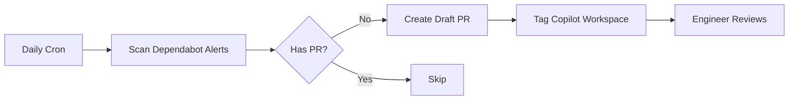

# Dependabot Wolf 🐺

Automated GitHub Action that fixes stuck Dependabot security alerts using GitHub Copilot Workspace.

## What It Does

When Dependabot can't create a PR to fix a security vulnerability (usually due to dependency conflicts), Dependabot Wolf:

1. Finds all open Dependabot alerts without PRs
2. Creates a draft PR for each stuck alert
3. Tags GitHub Copilot Workspace to propose a fix
4. Engineers review and merge (or close) the Copilot-generated fixes

## How It Works

## Installation

1. **Enable Dependabot alerts** on your repository (Settings → Security → Dependabot)

2. **Create a Personal Access Token (PAT)**:
   - Go to GitHub Settings → Developer settings → Personal access tokens → Fine-grained tokens
   - Create a token with the following permissions:
     - Repository access: Select the repository
     - Permissions:
       - `Contents`: Read and write
       - `Pull requests`: Read and write
       - `Security events`: Read only (for Dependabot alerts)
   - Copy the token

3. **Add the PAT as a repository secret**:
   - Go to your repository Settings → Secrets and variables → Actions
   - Create a new secret named `DEPENDABOT_PAT`
   - Paste your PAT as the value

4. **Copy the workflow file** `.github/workflows/dependabot-wolf.yml` to your repo

5. The workflow runs daily (via cron) or manually via `workflow_dispatch`

## Why a PAT is Required

GitHub's default `GITHUB_TOKEN` in workflows cannot access Dependabot alerts for security reasons. A Personal Access Token with `security_events` scope is required to read Dependabot alerts via the API.

## Configuration

The workflow requires the following permissions (configured via the PAT):
- `contents: write` - To create branches
- `pull-requests: write` - To create PRs
- `security-events: read` - To read Dependabot alerts

## Testing

This repo includes intentionally vulnerable dependencies to test the workflow:
- `lodash@4.17.15` (CVE-2020-8203)
- `minimist@0.0.8` (CVE-2020-7598)
- `axios@0.18.0` (CVE-2019-10742)

## License

MIT
