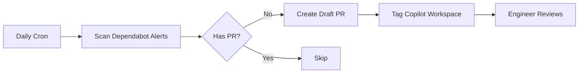

# Dependabot Wolf 🐺

Automated GitHub Action that fixes stuck Dependabot security alerts using GitHub Copilot Workspace.

## What It Does

When Dependabot security alerts remain unfixed, Dependabot Wolf automatically creates PR proposals using GitHub Copilot Workspace.

**Perfect for transitive dependency vulnerabilities:**
- Vulnerability is in a sub-dependency (e.g., `qs` via `body-parser`)
- Dependabot creates PR to update parent dependency without explaining why
- Teams reject/ignore PRs without security context
- **Wolf provides full context + Copilot assistance** to understand and fix

**"Stuck" alerts are those without open PRs:**
- Dependabot PR was closed (unclear purpose, breaking changes, rejected)
- Dependabot couldn't create a PR (dependency conflicts, peer mismatches)
- Alert is ignored (team doesn't understand the transitive relationship)

**Dependabot Wolf:**
1. Finds all open Dependabot alerts without open PRs
2. Creates draft PR with CVE details, affected packages, and dependency tree context
3. Tags `@github-copilot workspace` for AI-assisted analysis
4. Engineers use Copilot to understand transitive relationships and implement fix

## How It Works



## Installation

1. **Enable Dependabot alerts** on your repository (Settings → Security → Dependabot)

2. **Create a Personal Access Token (PAT)**:
   - Go to GitHub Settings → Developer settings → Personal access tokens → Fine-grained tokens
   - Create a token with the following permissions:
     - Repository access: Select the repository
     - Permissions:
       - `Contents`: Read and write
       - `Pull requests`: Read and write
       - `Security events`: Read only (for Dependabot alerts)
   - Copy the token

3. **Add the PAT as a repository secret**:
   - Go to your repository Settings → Secrets and variables → Actions
   - Create a new secret named `DEPENDABOT_PAT`
   - Paste your PAT as the value

4. **Copy the workflow file** `.github/workflows/dependabot-wolf.yml` to your repo

5. The workflow runs daily (via cron) or manually via `workflow_dispatch`

## Why a PAT is Required

GitHub's default `GITHUB_TOKEN` in workflows cannot access Dependabot alerts for security reasons. A Personal Access Token with `security_events` scope is required to read Dependabot alerts via the API.

## Configuration

The workflow requires the following permissions (configured via the PAT):
- `contents: write` - To create branches
- `pull-requests: write` - To create PRs
- `security-events: read` - To read Dependabot alerts

## Testing

This repo demonstrates a **transitive dependency vulnerability** that requires coordinated upgrades:

### The Scenario
We depend on `body-parser@1.19.0`, which transitively depends on vulnerable `qs@6.7.0`:
```
package.json: body-parser@1.19.0
  └─> qs@6.7.0 (vulnerable - CVE-2024-45801, GHSA-hrpp-h998-j3pp)
```

**Why Dependabot struggles:**
- Dependabot detects the `qs` vulnerability
- Cannot update just `qs` (it's a transitive dependency)
- May create PR to update `body-parser` but doesn't explain WHY
- Teams reject PRs without understanding the security context

**The solution requires insight:**
- Update `body-parser@1.19.0` → `1.20.3+`
- This automatically pulls in safe `qs@6.13.0+` (no direct changes needed)
- Requires understanding the transitive dependency relationship

**When Wolf activates:**
1. Dependabot creates PR OR alert remains without PR
2. Team closes PR or ignores alert (unclear what to do)
3. Wolf creates draft PR with full context and `@github-copilot workspace`
4. Copilot analyzes: "Update body-parser to fix transitive qs vulnerability"
5. Engineer understands and implements the fix

**See example:** https://github.com/playlab-education/playlab/pull/2234

## License

MIT
